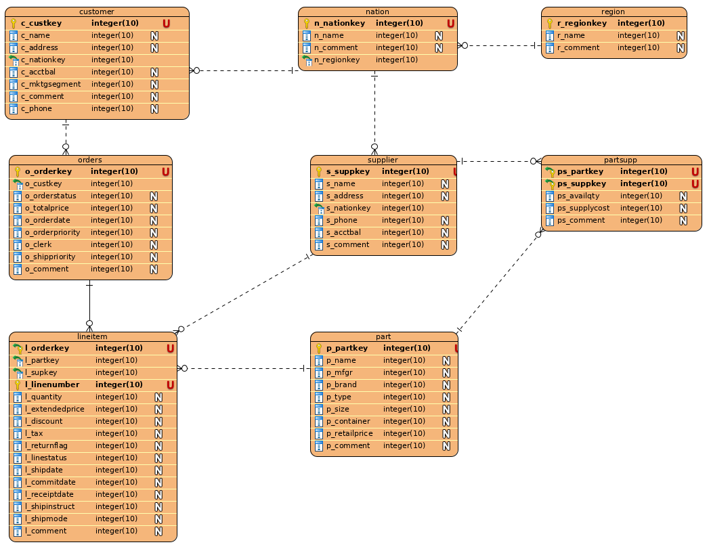

# TPC-DS

Links úteis:

- [TPC-DS](http://www.tpc.org/tpcds/default5.asp)
- [dbt3](https://sourceforge.net/projects/osdldbt/files/dbt3/) 
- [Referência para DDL](https://sites.google.com/site/halitsch88/Implementation-TPC-H-schema-into-MySQL-DBMS)

## Dicionário

### CUSTOMER

Nome | Tipo de Dado
-|-
c_custkey|integer
c_name|varchar(25)
c_address|varchar(40)
c_nationkey|integer
c_phone|char(15)
c_acctbal|decimal(15.2)
c_mktsegment|gar(10)
c_comment|varchar(117)

## LINEITEM

Nome | Tipo de Dado
-|-
l_partkey|integer
l_suppkey|integer
l_linenumber|integer
l_quantity|decimal(15,2)
l_extendedprice|decimal(15,2)
l_discount|decimal(15,2)
l_tax|decimal(15,2)
l_returnflag|char(1)
l_linestatus|char(1)
l_shipdate|date
l_commitdate|date
l_receiptdate|date
l_shipinstruct|char(25)
l_shipmode|char(10)
l_comment|varchar(44)


## NATION

Nome | Tipo de Dado
-|-
n_name|char(25)
n_regionkey|integer
n_comment|varchar(152)

## ORDERS

Nome | Tipo de Dado
-|-
o_orderkey|integer
o_custkey|integer
o_orderstatus|char(1)
o_totalprice|decimal(15,2)
o_orderdate|date
o_orderpriority|char(15)
o_clerk|char(15)
o_shippriority|integer
o_comment|varchar(79)

## PART

Nome | Tipo de Dado
-|-
p_partkey|integer
p_name|varchar(55)
p_mfgr|char(25)
p_brand|char(10)
p_type|varchar(25)
p_size|integer
p_container|char(10)
p_retailprice|decimal(15,2)
p_comment|varchar(23)

## PARTSUPP

Nome | Tipo de Dado
-|-
ps_partkey|integer
ps_supkey|integer
ps_availqty|integer
ps_supplycost|decimal(15,2)
ps_comment|varchar(199)

## REGION

Nome | Tipo de Dado
-|-
r_regionkey|integer
r_name|char(25)
r_comment|varchar(152)

## SUPPLIER

Nome | Tipo de Dado
-|-
s_supkey|integer
s_name|char(25)
s_address|varchar(40)
s_nationkey|integer
s_phone|char(15)
s_acctbal|decimal(15,2)
s_comment|varchar(101)


## ER



### Relacionamentos

Tabela|Join|Tabela
-|-|-
REGION|r_regionkey = n_regionkey|NATION
NATION|n_nationkey = c_nationkey|CUSTOMER
CUSTOMER|c_custkey = o_custkey|ORDERS
ORDERS|o_orderkey = l_orderkey|LINEITEM
LINEITEM|l_partkey = p_partkey|PART
LINEITEM|l_suppkey = s_suppkey|SUPPLIER
PARTSUPP|ps_partkey = p_partkey|PART
PARTSUPP|ps_suppkey = s_suppkey|SUPPLIER


# Ingestão de dados

- Os dados considerados foram gerados de forma a produzir 1GB de dados brutos

- Criar em `/SSD/docker-volumes/dremio-001/landing` o diretório `tcp-ds`

```sh
sudo -i
mkdir -p /SSD/docker-volumes/dremio-001/landing/tcp-ds
chmod 777 /SSD/docker-volumes/dremio-001/landing/tcp-ds
```

- Copiar para `/SSD/docker-volumes/dremio-001/landing/tcp-ds` or arquivos gerados via dbt-3 e conpactar com gzip (`gzip -9 *.tbl`), são esperados os seguintes arquivos:
   - customer.tbl.gz
   - lineitem.tbl.gz
   - nation.tbl.gz
   - orders.tbl.gz
   - part.tbl.gz
   - partsupp.tbl.gz
   - region.tbl.gz
   - supplier.tbl.gz

- Para carga de arquivos, o diretório `/SSD/docker-volumes/dremio-001/landing/tcp-ds` será configurado como NAS, ficando disponível para o Dremio em `/tmp/tcp-ds`, de acordo com a seguinte configuração:
   - General
      - Name: tcp-ds
      - Month path: `/tmp/tcp-ds`
   - Advanced options
      - Enable exports into the source (CTAS and DROP): FALSE (default)
   - Reflection Refresh:
      - Never refresh: FALSE (default)
      - Never expire: FALSE (default)
   - Metadata:
      - Remove dataset definitions if underlying data is unavailable: TRUE (default)
      - Automatically format files into physical datasets when users issue queries: FALSE (default)
      - Metadata Refresh
         - Fetch mode: Only Queried Datasets (default)
         - Fetch every: 1 Hour(s) (default)
         - Expire after: 3 Hour(s) (default)

- Na fonte **tcp-ds**, para cada um dos arquivos, através do Dremio, proceder **Format file**, considerando:
   - Format: Text (delimited)
   - Field Delimiter: `|` (pipe)
   - Line Delimiter: LF - Unix/Linux
   - Dedault para os demais valores

- Considerações:
   - O Dremio reconhece que os arquivos estão compactados e procede a descompactação quando do acesso dos mesmos
   - A compactação é empregada para salvar espaço em disco
   - Os arquivos em questão não possuem o nome das colunas informadas, os nomes devem ser buscados na documentação do processo de benchmark
   - Todos os dados são carregados como texto

## Volumetria

Arquivo | Registros
-|- 
customer.tbl.gz | 150.000
lineitens.tbl.gz | 6.001.215
nation.tbl.gz | 25
orders.tbl.gz | 150.000
part.tbl.gz | 200.000
partsupp.tbl.gz | 800.000
region.tbl.gz | 5
supplier.tbl.gz | 10.000

## Camadas Semanticas no Dremio

### Preparation

É a camada mais próxima dos Data Sources, ela responde pela organização e exposição dos dados, se restringindo somente aos data sets exigidos (no caso deste estudo, os arquivos `*.tbl.gz`). Normalmente de responsabilidade dos Engenheiros de Dados, a criação dos VDS irá permitir:

- Definição de alias de colunas
- Cast de tipo de dados
- Criação de campos derivados
- Limpesa de dados

Não são feitos joins nesta camada.

### Business

Construída a partir de recursos da camada BUSINESS ou PREPARATION, nesta camada as VDS são nomeadas de acordo com a perspectiva de negócio, sendo a primeira comada onde ocorrem `joins`, inclusive entre dados de diferents origens de dados.

_Tipicamente, é nesta camada onde trabalham os responsáveis pela modelagem de dados**, sendo correta a criação de sublayers dentro da layer desta layer_

### Application

Tem por objetivo mapear a VDS criadas na BUSINESS layer **para o formato esperado pelos usuários**, descrevendo as entidades de negócio chave.

## Carga e Configuração da Camada **Preparation**

### customer

```sql
SELECT   *
FROM     "tcp-ds"."customer.tbl.gz"
```

As seguintes tranformações foram feitas através do ambiente assistido:
- Renomear colunas
   - A: c_custkey
   - B: c_name
   - C: c_address
   - D: c_nationkey
   - E: c_phone
   - F: c_acctbal
   - G: c_mktgsegment
   - H: c_comment
- Cast de dados
   - c_custkey: INT
   - c_nationkey: INT
   - c_acctbal: DECIMAL(15,2)

(*) DECIMAL não é uma opção, foi usado FLOAT

```sql
SELECT   CONVERT_TO_INTEGER(A, 1, 1, 0) AS c_custkey, 
         B AS c_name, 
         C AS c_address, 
         CONVERT_TO_INTEGER(D, 1, 1, 0) AS c_nationkey, 
         E AS c_phone, 
         CONVERT_TO_FLOAT(F, 1, 1, 0) AS c_acctbal, 
         G AS c_mktgsegment, 
         H AS c_comment
FROM     "tcp-ds"."customer.tbl.gz" AS "customer.tbl.gz"
```
(*) Adicionada uma RAW REFLECTION, considerando todas as colunas, sem critério de sort e particionada por país

### lineitem

```sql
SELECT   *
FROM     "tcp-ds"."lineitem.tbl.gz"
```

As seguintes tranformações foram feitas através do ambiente assistido:
- Renomear colunas
   - A: l_orderkey
   - B: l_partkey
   - C: l_suppkey
   - D: l_linenumber
   - E: l_quantity
   - F: l_extendedprice
   - G: l_discount
   - H: l_tax
   - I: l_returnflag
   - J: l_linestatus
   - K: l_shipdate
   - L: l_commitdate
   - M: l_receiptdate
   - N: l_shipinstruct
   - O: l_shipmode
   - P: l_comment
- Cast de dados
   - l_orderkey: INT
   - l_partkey: INT
   - l_suppkey: INT
   - l_linenumber: INT
   - l_quantity: DECIMAL(15,2)
   - l_extendedprice: DECIMAL(15,2)
   - l_discount: DECIMAL(15,2)
   - l_tax: DECIMAL(15,2)
   - l_shipdate: DATE
   - l_commitdate: DATE
   - l_receiptdate: DATE

(*) DECIMAL não é uma opção, foi usado FLOAT

```sql
SELECT   CONVERT_TO_INTEGER(A, 1, 1, 0) AS l_orderkey, 
         CONVERT_TO_INTEGER(B, 1, 1, 0) AS l_partkey, 
         CONVERT_TO_INTEGER(C, 1, 1, 0) AS l_suppkey, 
         CONVERT_TO_INTEGER(D, 1, 1, 0) AS l_linenumber, 
         CONVERT_TO_FLOAT(E, 1, 1, 0) AS l_quantity, 
         CONVERT_TO_FLOAT(F, 1, 1, 0) AS l_extendedprice, 
         CONVERT_TO_FLOAT(G, 1, 1, 0) AS l_discount, 
         CONVERT_TO_FLOAT(H, 1, 1, 0) AS l_tax, 
         I AS l_returnflag, 
         J AS l_linestatus, 
         TO_DATE(K, 'YYYY-MM-DD', 1) AS l_shipdate, 
         TO_DATE(L, 'YYYY-MM-DD', 1) AS l_commitdate, 
         TO_DATE(M, 'YYYY-MM-DD', 1) AS l_receiptdate, 
         N AS l_shipinstruct, 
         O AS l_shipmode, 
         P AS l_comment
FROM     "tcp-ds"."lineitem.tbl.gz" AS "lineitem.tbl.gz"
```

(*) Adicionada uma RAW REFLECTION, considerando todas as colunas, sem critério de sort e sem particionamento

## nation

```sql
SELECT   *
FROM     "tcp-ds"."nation.tbl.gz"
```

As seguintes tranformações foram feitas através do ambiente assistido:
- Renomear colunas
   - A: n_nationkey
   - B: n_name
   - C: n_comment
- Cast de dados
   - n_nationkey: INT

```sql
SELECT   CONVERT_TO_INTEGER(A, 1, 1, 0) AS n_nationkey, 
         B AS n_name, 
         CONVERT_TO_INTEGER(C, 1, 1, 0) AS n_regionkey,
         D AS n_comment
FROM     "tcp-ds"."nation.tbl.gz" AS "nation.tbl.gz"
```

(*) Adicionada uma RAW REFLECTION, considerando todas as colunas, sem critério de sort e sem particionamento - trata-se de uma tabela pequena

**orders**

```sql
SELECT   *
FROM     "tcp-ds"."orders.tbl.gz"
```

As seguintes tranformações foram feitas através do ambiente assistido:
- Renomear colunas
   - A: o_orderkey 
   - B: o_custkey
   - C: o_orderstatus
   - D: o_totalprice
   - E: o_orderdate
   - F: o_orderpriority
   - G: o_clerk
   - H: o_shippriority
   - I: o_comment
- Cast de dados
   - o_orderkey: INT
   - o_custkey: INT
   - o_totalprice: DECIMAL(15,2)
   - o_orderdate: DATE
   - o_shippriority: INT

(*) DECIMAL não é uma opção, foi usado FLOAT

```sql
SELECT   CONVERT_TO_INTEGER(A, 1, 1, 0) AS o_orderkey, 
         CONVERT_TO_INTEGER(B, 1, 1, 0) AS o_custkey, 
         C AS o_orderstatus, 
         CONVERT_TO_FLOAT(D, 1, 1, 0) AS o_totalprice, 
         TO_DATE(E, 'YYYY-MM-DD', 1) AS o_orderdate, 
         F AS o_orderpriority, G AS o_clerk, 
         CONVERT_TO_INTEGER(H, 1, 1, 0) AS o_shippriority, 
         I AS o_comment
FROM     "tcp-ds"."orders.tbl.gz" AS "orders.tbl.gz"
```

(*) Adicionada uma RAW REFLECTION, considerando todas as colunas, sem critério de sort e sem particionamento

## part

```sql
SELECT   *
FROM     "tcp-ds"."part.tbl.gz"
```

As seguintes tranformações foram feitas através do ambiente assistido:
- Renomear colunas
   - A: p_partkey
   - B: p_name
   - C: p_mfgr
   - D: p_brand
   - E: p_type
   - F: p_size
   - G: p_container
   - H: p_retailprice
   - I: p_comment
- Cast de dados
   - p_partkey: INT
   - p_size: INT
   - p_retailprice: DECIMAL(15,2)

(*) DECIMAL não é uma opção, foi usado FLOAT

```sql
SELECT   CONVERT_TO_INTEGER(A, 1, 1, 0) AS p_partkey, 
         B AS p_name, 
         C AS p_mfgr, 
         D AS p_brand, 
         E AS p_type, 
         CONVERT_TO_INTEGER(F, 1, 1, 0) AS p_size, 
         G AS p_container, 
         CONVERT_TO_FLOAT(H, 1, 1, 0) AS p_retailprice, 
         I AS p_comment
FROM "tcp-ds"."part.tbl.gz" AS "part.tbl.gz"
```

(*) Adicionada uma RAW REFLECTION, considerando todas as colunas, sem critério de sort e sem particionamento

## partsupp

```sql
SELECT   *
FROM     "tcp-ds"."partsupp.tbl.gz"
```

As seguintes tranformações foram feitas através do ambiente assistido:
- Renomear colunas
   - A: ps_partkey
   - B: ps_suppkey
   - C: ps_availqty
   - D: ps_supplycost
   - E: ps_comment
- Cast de dados
   - ps_partkey: INT
   - ps_suppkey: INT
   - ps_availqty: INT
   - ps_supplycost: DECIMAL(15,2)

(*) DECIMAL não é uma opção, foi usado FLOAT

```sql
SELECT   CONVERT_TO_INTEGER(A, 1, 1, 0) AS ps_partkey, 
         CONVERT_TO_INTEGER(B, 1, 1, 0) AS ps_suppkey, 
         CONVERT_TO_INTEGER(C, 1, 1, 0) AS ps_availqty, 
         CONVERT_TO_FLOAT(D, 1, 1, 0) AS ps_supplycost, 
         E AS ps_comment
FROM  "tcp-ds"."partsupp.tbl.gz" AS "partsupp.tbl.gz"
```

(*) Adicionada uma RAW REFLECTION, considerando todas as colunas, sem critério de sort e sem particionamento

## region

```sql
SELECT   *
FROM     "tcp-ds"."region.tbl.gz"
```

As seguintes tranformações foram feitas através do ambiente assistido:
- Renomear colunas
   - A: r_regionkey
   - B: r_name
   - C: r_comment
- Cast de dados
   - r_regionkey: INT

```sql
SELECT   CONVERT_TO_INTEGER(A, 1, 1, 0) AS r_regionkey, 
         B AS r_name, 
         C AS r_comment
FROM     "tcp-ds"."region.tbl.gz" AS "region.tbl.gz"
```

(*) Adicionada uma RAW REFLECTION, considerando todas as colunas, sem critério de sort e sem particionamento - trata-se de uma tabela pequena

## supplier

```sql
SELECT   *
FROM     "tcp-ds"."supplier.tbl.gz"
```

As seguintes tranformações foram feitas através do ambiente assistido:
- Renomear colunas
   - A: s_suppkey 
   - B: s_name
   - C: s_address
   - D: s_nationkey
   - E: s_phone
   - F: s_acctbal
   - G: s_comment
- Cast de dados
   - s_suppkey: INT
   - s_nationkey: INT
   - s_acctbal: DECIMAL(15,2)

```sql
SELECT   CONVERT_TO_INTEGER(A, 1, 1, 0) AS s_suppkey, 
         B AS s_name, C AS s_address, 
         CONVERT_TO_INTEGER(D, 1, 1, 0) AS s_nationkey, 
         E AS s_phone, 
         CONVERT_TO_FLOAT(F, 1, 1, 0) AS s_acctbal, 
         G AS s_comment
FROM     "tcp-ds"."supplier.tbl.gz" AS "supplier.tbl.gz"
```

(*) Adicionada uma RAW REFLECTION, considerando todas as colunas, sem critério de sort e particionado por s_nationkey

